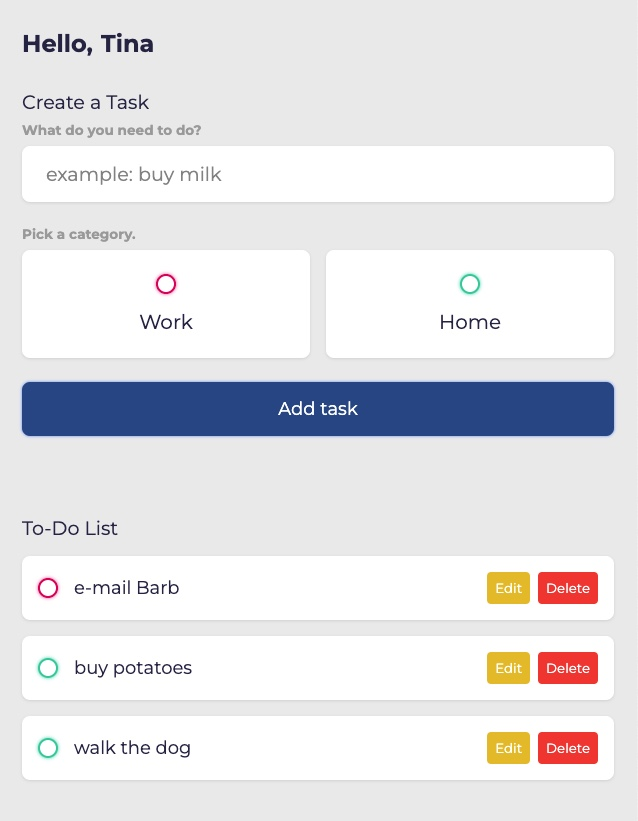
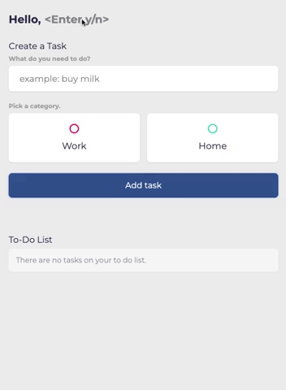
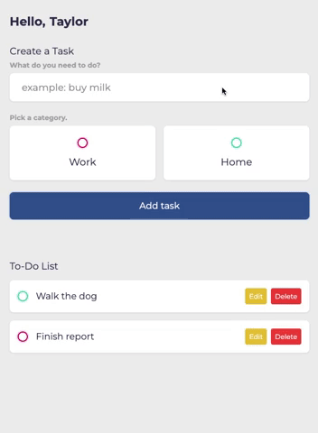

# To Do List
I created this application to practice using **localStorage**. This was built using: 
- HTML
- CSS
- JavaScript




______________

## Demo
The user can:
- Change their name.
- Create and store tasks.
- Mark tasks as complete.
- Edit tasks
- Delete tasks.





___________

## Features

- New tasks can not be added without a task description *and* a chosen category.
- The user is notified if there are no tasks entered.
- Information is stored in localStorage and persists when the page is refreshed.

________

## Installation Steps
1. Clone this repository into the directory of your choice.
2. Navigate to this directory in your terminal.
3. In your terminal, enter:
   ```
   npx live-server .
   ```
4. Use this app in the newly-opened browser window.

_____

## Stretch Goals
- Display the date that the task was added.
- Add filter to sort tasks according to the date that they were added.
- Add filter to sort tasks by type.

